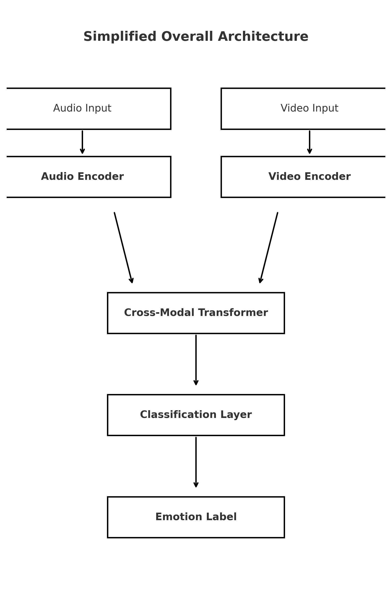

# Cross-Modal Transformer Fusion for Multimodal Emotion Recognition

## Project Description
This project implements a **multimodal emotion recognition model** that integrates **audio** and **visual** cues using **CNN–BiLSTM encoders** and a **Transformer-based cross-modal fusion** mechanism.  
The model is trained on the **RAVDESS** dataset and evaluated on both **RAVDESS** and **MELD**, aiming to classify human emotions from synchronized **speech** and **facial expressions**.

---

## Proposed Model Architecture
The architecture includes:
- **Audio Encoder:** CNN → BiLSTM → Transformer Encoder for long-range temporal dependencies in audio.
- **Video Encoder:** ResNet18 + BiLSTM for spatio-temporal feature extraction from facial frames.
- **Cross-Modal Fusion:** Transformer-style attention aligning audio and video embeddings.
- **Classifier:** Combines fused features and predicts the final emotion category.

<div align="center">
  
</div>

---

## How to Run

### 1. Open the Notebook
Open the notebook file:
```
MultiModal.ipynb
```

You can run it on **Kaggle** with GPU acceleration.

#### Enable GPU: *Settings → Accelerator → GPU*  

---

### 2. Install Dependencies
Before running any code cells, install the dependencies in the first cell of the notebook.

---

### 3. Download Datasets (via Kaggle)

#### RAVDESS – Ryerson Audio-Visual Database of Emotional Speech and Song
[Kaggle Link](https://www.kaggle.com/datasets/orvile/ravdess-dataseto)

#### MELD – Multimodal EmotionLines Dataset
[Kaggle Link](https://www.kaggle.com/datasets/zaber666/meld-dataset)

---

### 4. Run the Notebook
Once datasets and dependencies are ready:

1. Open `MultiModal.ipynb`  
2. Enable GPU  
3. Click **“Run All”**

The notebook will:
- Preprocess and load both datasets  
- Train the **AVFusionModel** on RAVDESS and MELD separately
- Evaluate performance on both **RAVDESS** and **MELD** for both the models
- Save the best model automatically in the `output/` directory  

---

## Workflow Summary
1. Audio features → CNN–LSTM–Transformer → Audio summary vector  
2. Video frames → ResNet18 + LSTM → Video sequence embeddings  
3. Audio summary guides attention over video sequence via Cross-Modal Fusion  
4. Combined vector classified into emotion categories (e.g., happy, sad, angry, etc.)

---

## Authors
- **Aniket Gupta**  
- **Arush Jain**  
Indian Institute of Technology, Guwahati  

---

## License
This project is released under the **MIT License**.

---
